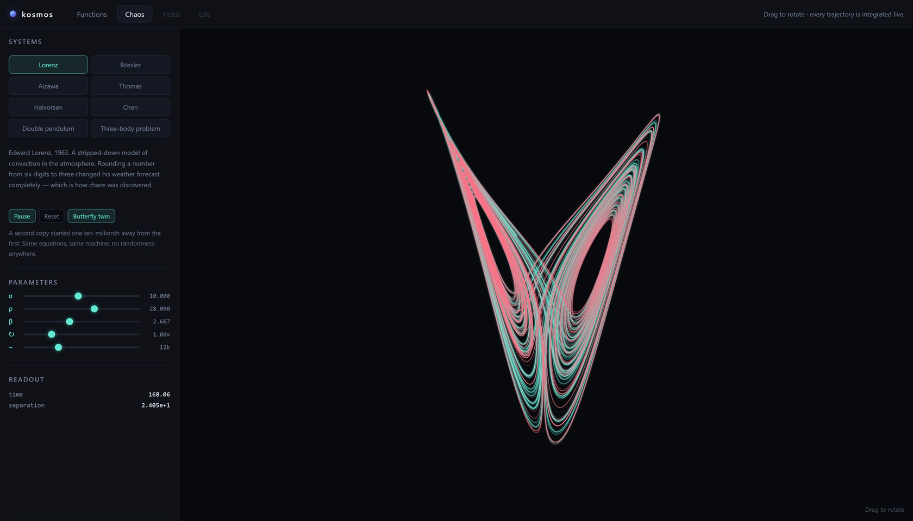
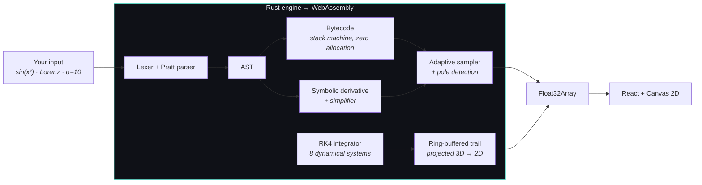
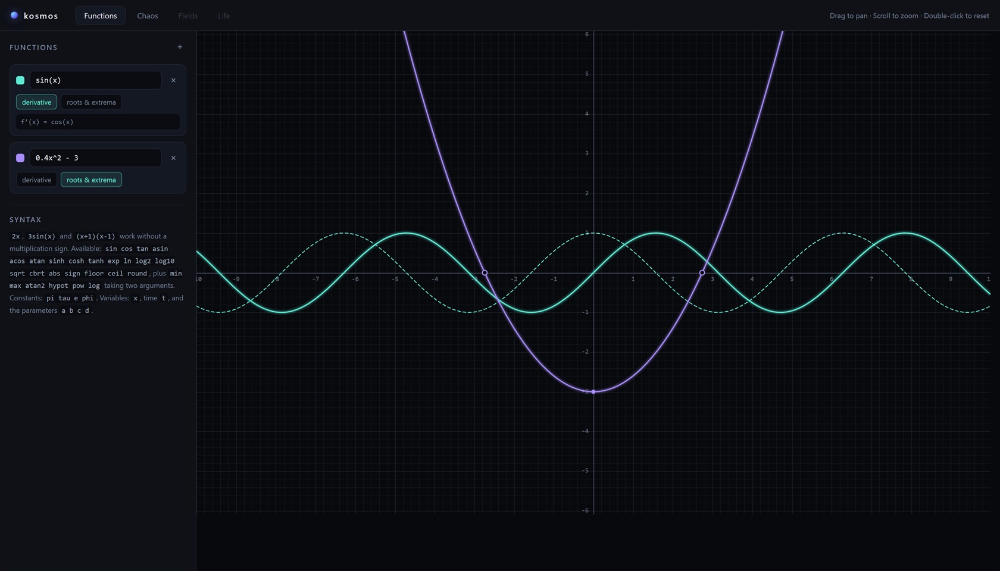
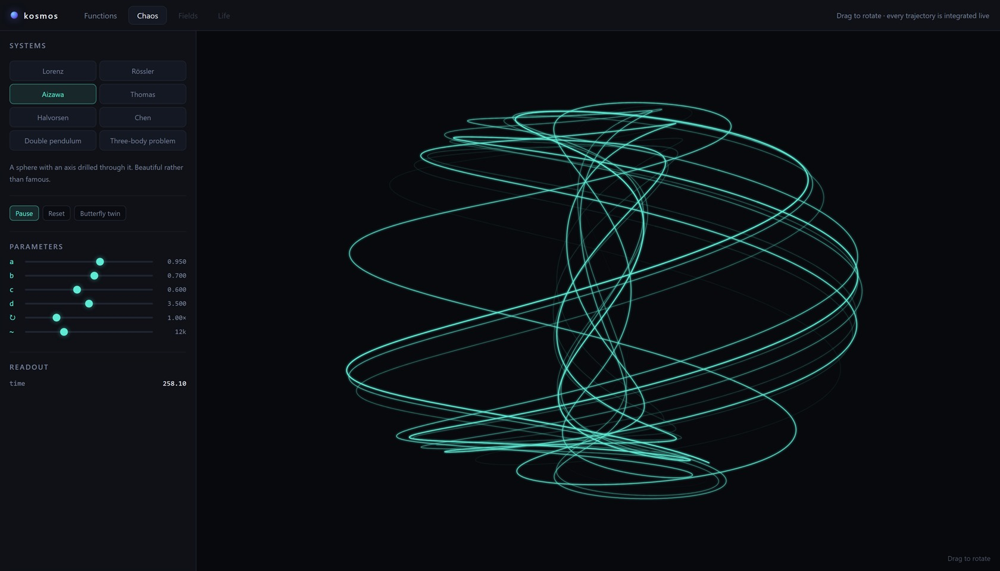
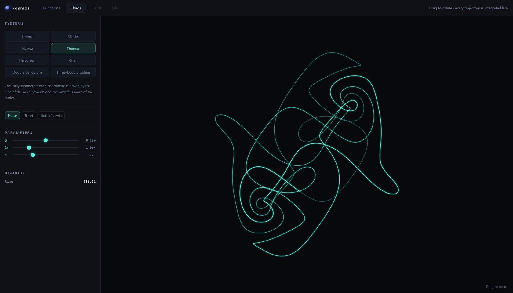
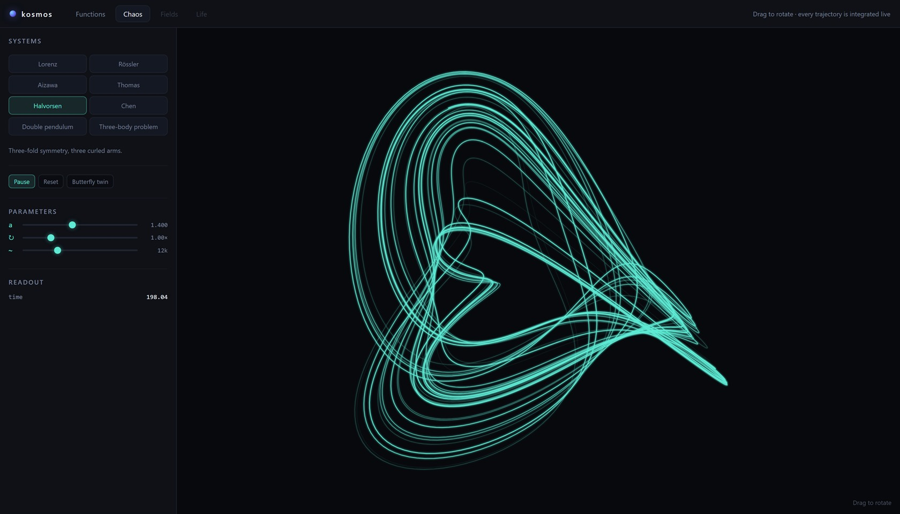
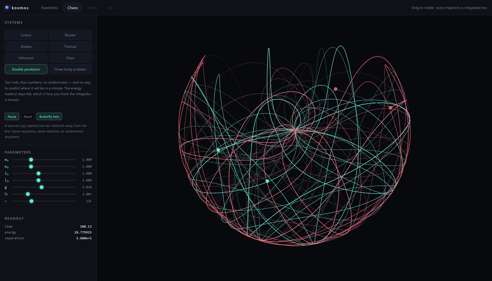
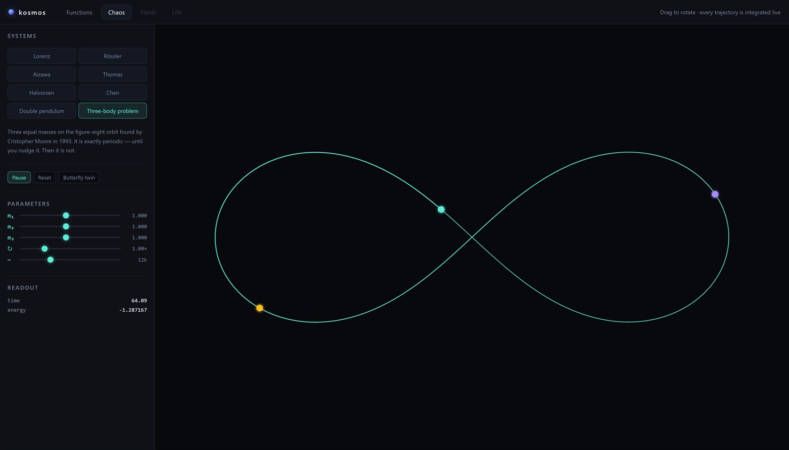

<div align="center">

# kosmos

### An interactive calculator for the natural world

Mathematics, physics and biology — computed in Rust, rendered live in your browser.

[](https://github.com/justinjd00/kosmos/actions)
[](https://justinjd00.github.io/kosmos/)
[](https://github.com/justinjd00/kosmos/pkgs/container/kosmos)
[](LICENSE)

**[Open it →](https://justinjd00.github.io/kosmos/)**

<br>



</div>

<br>

> [!NOTE]
> Nothing is sent anywhere. The parser, the calculus, the solvers — all of it is Rust compiled to
> WebAssembly, running on your machine. No account, no telemetry, no network calls. Load the page
> once and it works on a plane.

## Why bother with Rust

A function plotter is easy in any language. What is hard is everything you want *after* the plot:
a reaction–diffusion grid stepping at 60 frames per second, a three-body problem integrated while
you drag a planet, a hundred thousand adaptive samples recomputed on every zoom. That is not a
JavaScript workload.

So the split is: **Rust computes, React presents.** The canvas receives finished `Float32Array`
point lists straight out of linear memory — no JSON, no per-point marshalling across the boundary.



<br>

## Functions & calculus



**The derivative is symbolic, not numerical.** Type `sin(x^2)` and the engine differentiates the
syntax tree by the chain rule, simplifies the result, and hands back a real expression:

$$\frac{d}{dx}\sin(x^2) = \cos(x^2)\cdot 2x$$

It is printed in the sidebar and plotted as a dashed curve. Every rule is checked against a central
difference quotient — two independent routes to the same number:

$$\left|\ \underbrace{f'(x)}_{\text{symbolic}} - \underbrace{\frac{f(x+h)-f(x-h)}{2h}}_{\text{numerical}}\ \right| < 10^{-5}$$

**Poles are told apart from roots.** Both look identical to a naive plotter: the sign flips. So at
every sign change the interval is bisected fourteen times and the values are watched. Collapsing
toward zero means a root. Growing without bound means a pole — and the line breaks instead of
drawing a vertical stroke that isn't there:

$$\min\big(|f(a)|,|f(b)|\big) > \max\big(|f(x_0)|,|f(x_2)|\big) \implies \text{pole}$$

That single check is why `tan(x)` looks right.

**Sampling follows curvature, not the x-axis.** Flat stretches get a handful of points, tight turns
get hundreds — and the bend is measured in *screen space*, because whether a curve looks kinked
depends on your zoom, not on the numbers.

<details>
<summary><b>What the expression language accepts</b></summary>

<br>

| | |
|---|---|
| **Operators** | `+ - * / ^ %` and brackets `( ) [ ] { }` |
| **Implicit product** | `2x`, `3sin(x)`, `(x+1)(x-1)`, `2pi` — no `*` needed |
| **One argument** | `sin cos tan asin acos atan sinh cosh tanh exp ln log2 log10 sqrt cbrt abs sign floor ceil round` |
| **Two arguments** | `min max atan2 hypot pow log` |
| **Constants** | `pi tau e phi` |
| **Variables** | `x`, time `t`, and the parameters `a b c d` on sliders |

Errors carry the exact character position, so a typo gets underlined rather than described:

```
2 + $
    ^ unexpected character '$'
```

Precedence comes from a Pratt parser, so `2^3^2` is $2^{(3^2)} = 512$ and `1-2-3` is
$(1-2)-3 = -4$, exactly as mathematics expects. `3x^2` parses as $3x^2$, not $(3x)^2$.

</details>

<br>

## Chaos

Eight systems, integrated live with fourth-order Runge–Kutta. Drag to rotate the spatial ones.

<table>
<tr>
<td width="33%"></td>
<td width="33%"></td>
<td width="33%"></td>
</tr>
<tr>
<td align="center"><a href="https://justinjd00.github.io/kosmos/#chaos/aizawa"><b>Aizawa</b></a></td>
<td align="center"><a href="https://justinjd00.github.io/kosmos/#chaos/thomas"><b>Thomas</b></a></td>
<td align="center"><a href="https://justinjd00.github.io/kosmos/#chaos/halvorsen"><b>Halvorsen</b></a></td>
</tr>
</table>

The Lorenz system is three lines of arithmetic — a stripped-down model of a convecting fluid:

$$
\dot{x} = \sigma(y-x), \qquad
\dot{y} = x(\rho-z)-y, \qquad
\dot{z} = xy-\beta z
$$

With $\sigma=10$, $\rho=28$, $\beta=8/3$ it never repeats and never escapes. In 1963 Edward Lorenz
restarted a weather simulation from a printout rounded to three digits instead of six and got a
completely different forecast. That accident is where chaos theory starts.

| System | Dim. | Why it's here |
|---|:--:|---|
| [Lorenz](https://justinjd00.github.io/kosmos/#chaos/lorenz) | 3 | The original. Convection, and the discovery of chaos |
| [Rössler](https://justinjd00.github.io/kosmos/#chaos/rossler) | 3 | Designed in 1976 to be the *simplest* possible chaotic system |
| [Aizawa](https://justinjd00.github.io/kosmos/#chaos/aizawa) | 3 | A sphere with an axis drilled through it |
| [Thomas](https://justinjd00.github.io/kosmos/#chaos/thomas) | 3 | Cyclically symmetric — each axis driven by the sine of the next |
| [Halvorsen](https://justinjd00.github.io/kosmos/#chaos/halvorsen) | 3 | Three-fold symmetry, three curled arms |
| [Chen](https://justinjd00.github.io/kosmos/#chaos/chen) | 3 | A cousin of Lorenz, not topologically equivalent to it |
| [Double pendulum](https://justinjd00.github.io/kosmos/#chaos/double-pendulum) | 4 | Conserves energy — which makes it a test |
| [Three-body problem](https://justinjd00.github.io/kosmos/#chaos/three-body) | 12 | Exactly periodic — which makes it a better test |

<br>

## The butterfly effect, as a button

> [!TIP]
> Open [**Lorenz with a butterfly twin**](https://justinjd00.github.io/kosmos/#chaos/lorenz+twin)
> and watch the `separation` readout climb.

**Butterfly twin** forks the running system and displaces it by $10^{-7}$ — about the width of a
virus, on a scale of tens. Same equations. Same machine. No randomness anywhere in the code.

The gap between the two grows exponentially, governed by the largest Lyapunov exponent, which is
$\lambda \approx 0.9$ for Lorenz:

$$\delta(t) \approx \delta_0\, e^{\lambda t}$$

so a difference in the seventh decimal reaches order 1 in roughly

$$t \approx \frac{\ln(10^{7})}{0.9} \approx 18\ \text{seconds}$$

The image at the top of this page is that moment several times over: started $10^{-7}$ apart, now
$2.4 \times 10^{1}$ apart, two coloured threads wandering the same shape along completely different
paths. This is also, precisely, why weather forecasts fall apart after about ten days — not because
the models are bad, but because the atmosphere multiplies every measurement error.

<br>

## Two systems that double as proofs

Simulations are easy to get subtly wrong, because *plausible* and *correct* look the same on
screen — and in a chaotic system everything looks different anyway. So the suite leans on
**invariants**: quantities that mathematics forbids from changing.

<table>
<tr>
<td width="50%" valign="top">



**Energy must stay flat**

A frictionless pendulum cannot gain or lose energy. After 20,000 steps the test demands

$$\frac{|E(t) - E_0|}{|E_0|} < 10^{-4}$$

Break the integrator and the readout drifts, so CI fails instead of quietly rendering something
that merely looks like a pendulum.

</td>
<td width="50%" valign="top">



**The orbit must close**

Three equal masses chasing each other along a figure eight — found by Cristopher Moore in 1993 and
exactly periodic with $T = 6.3244490664$.

The test integrates one full period and checks that **all twelve** state variables return to where
they began. One wrong sign anywhere and the orbit never comes home.

</td>
</tr>
</table>

<br>

## Deep links

Every view has a URL, so a system, an experiment or a pre-run state can be shared as a plain link.

| Link | Meaning |
|---|---|
| [`#functions`](https://justinjd00.github.io/kosmos/#functions) | the plotter |
| [`#chaos/lorenz`](https://justinjd00.github.io/kosmos/#chaos/lorenz) | a specific system |
| [`#chaos/lorenz+twin`](https://justinjd00.github.io/kosmos/#chaos/lorenz+twin) | with the butterfly twin running |
| [`#chaos/thomas@300`](https://justinjd00.github.io/kosmos/#chaos/thomas@300) | fast-forwarded 300 simulated seconds before the first frame |

The `@` suffix is also what makes the screenshots in this README reproducible: they are taken by
[`tools/shoot.ps1`](tools/shoot.ps1) against a headless browser, not captured by hand.

<br>

## Self-hosting

kosmos is a static site plus one `.wasm` file. Anything that can serve files can host it.

<details open>
<summary><b>Docker</b></summary>

<br>

```sh
docker run -p 8080:80 ghcr.io/justinjd00/kosmos
```

or build it yourself:

```sh
git clone https://github.com/justinjd00/kosmos
cd kosmos
docker compose up -d          # http://localhost:8080
```

Change the port with `KOSMOS_PORT=9000 docker compose up -d`.

</details>

<details>
<summary><b>Any web server — nginx, Caddy, S3, a Raspberry Pi …</b></summary>

<br>

```sh
cd web && npm ci && npm run build
```

Copy `web/dist/` wherever you like.

> [!IMPORTANT]
> `.wasm` files must be served as `application/wasm`. nginx and Caddy do this by default;
> `python3 -m http.server` does **not**, and the app will refuse to start.

The build uses relative paths, so it also works from a subdirectory such as
`https://example.com/tools/kosmos/` with no configuration.

A ready-made nginx config sits in [`deploy/nginx.conf`](deploy/nginx.conf). For Caddy:

```
example.com {
    root * /srv/kosmos
    file_server
    try_files {path} /index.html
}
```

</details>

<details>
<summary><b>Building from source</b></summary>

<br>

Requires Rust 1.75+, [wasm-pack](https://rustwasm.github.io/wasm-pack/) and Node 20+.

```sh
cargo install wasm-pack

cd core
wasm-pack build --release --target web --out-dir ../web/src/wasm --out-name kosmos

cd ../web
npm ci && npm run dev
```

> [!WARNING]
> The dev server hot-reloads TypeScript but **not Rust**. After every change in `core/`, run
> `wasm-pack build` again — otherwise the browser keeps running the old engine. This is the single
> most common source of confusion in this architecture.

</details>

<br>

## Tests

```sh
cd core && cargo test
```

40 tests, no `unsafe`, six dependencies.

| Area | What is checked |
|---|---|
| **Parser** | precedence, associativity, implicit products, error positions |
| **Evaluator** | arithmetic, unary minus, integer-power optimisation, NaN instead of panics |
| **Calculus** | chain, product and quotient rule, $x^x$ — all against finite differences |
| **Plotting** | poles vs. roots, curvature-driven sampling, undefined regions |
| **Dynamics** | boundedness, energy conservation, orbital periodicity, exponential divergence |

<br>

## Roadmap

- [x] **Functions** — expression language, symbolic calculus, adaptive plotting
- [x] **Chaos** — eight systems, RK4, butterfly twin, deep links
- [ ] **Fields** — the wave equation, heat diffusion, electrostatics, solved live
- [ ] **Life** — Turing patterns, predator–prey dynamics, epidemics, cellular automata

<br>

## License

[MIT](LICENSE) — named after Alexander von Humboldt's *Kosmos*, his attempt to describe the whole of
nature in a single work.
